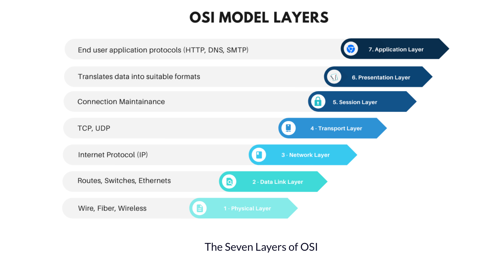

# Instruction

Please answer below, without modifying the question

## Part 1.1. Network (12 marks)

### Question 1 (1 mark)

> List the 7 OSI Network layers

Answer in the block below:

```

The Open Systems Interconnection (OSI) model describes seven layers of technology used to communicate over a network, these are:
7) Application
6) Presentation
5) Session
4) Transport
3) Network
2) Data Link
1) Physical

Source:  https://www.freecodecamp.org/news/osi-model-computer-networking-for-beginners/

```

### Question 2 (2 marks)

> What is the purpose of the Physical layer (L1) in the OSI model? How does it differ from the Data Link layer (L2)?

Answer in the block below:

```

The first layer of the OSI model is the physical layer, L1.
For example, the "digital mana" (data/knowledge economy/bits/light) transferred between communities on the network, over a physical medium for active transport. Data can get transferred in many different ways such as radio waves or even light.
L1 services include:
•	Transmission of a raw bit stream over a physical medium
•	Synchronization of the bit stream
•	Line coding to ensure reliable transmission
•	Physical addressing
•	Physical topology
•	Bit rate control

The second layer OSI Layer is Two, L2, the Data Link Layer, which routes bits between “nodes’ on a network.
For example, a hospital local area network (LAN) may have different devices for analysing tests and lab results, connected through switches and ethernets in the data link layer.
L2 services include:
•	Framing
•	Physical addressing
•	Flow control
•	Error control
•	Access control


```

### Question 3 (2 marks)

> What is the purpose of the Network layer (L3) in the OSI model? What problem does the Network layer (L3) solve for the Data Link layer (L2)?

Answer in the block below:

```

The third layer of the OSI model is the Network Layer, L3, which provides the functional and procedural means of transferring data sequences from source to a destination i.e. Internet Protocol (IP).
Similar to your brain's "Executive Function," cortex under your forehead provides routing analysis and responsibility.
The L3 services include:
•	Quality of Service (QoS)
•	Flow Control and
•	Error Control Routing, when interrupted.


```

# Question 4 (3 marks)

> What is the purpose of the Transport layer (L4) in the OSI model? What problem does the Transport layer (L4) solve for the Network layer (L3)? What are some common protocols used at the Transport layer (L4)?

Answer in the block below:

```
The fourth layer of the OSI model is Layer Four, L4, Transport Layer. L4 solves the problem of effective communication between nodes in the L3, Network and Transport Layers. It does so through effective network transmission (i) packing data into smaller chunks (ii) monitoring for packet loss (iii) putting the data back together again (iv), and terminating the connection when transmission is complete.
Mechanisms of the Transport Layer are:
•	Transmission Control Protocol (TCP)
•	User Datagram Protocol (UDP)
•	Stream Control Transmission Protocol (SCTP)

L4 turns “digital mana” (information/data/bites) into transferrable segments, then puts the pieces back together again at the other end.


```

### Question 5 (1 mark)

> Convert decimal number `689` into Binary

Answer in the block below:

```

To convert the decimal number ‘689’ into binary:
689 / 2 = 344 with 1 remainder
344 / 2 = 172 with 0 remainder
172 / 2 = 86 with 0 remainder
86 / 2 = 43 with 0 remainder
43 / 2 = 21 with 1 remainder
21 / 2 = 10 with 1 remainder
10 / 2 = 5 with 0 remainder
5 / 2 = 2 with 1 remainder
2 / 2 = 1 with 0 remainder
1 / 2 = 0 with 1 remainder

The decimal number 689, in binary = 1010110001.

```

### Question 6 (1 mark)

> How many IPs can you have with subnet mask 10.0.0.0/8? Divide this further into 2 smaller subnets of your liking (can use subnet divider tools).

Answer in the block below:

```


IP Address =10.0.0.0, Slash Notation = 10.0.0.0/8, Subnet Mask = 255.0.0.0, Subnets = 0
Number of IP/Hosts = 16 million (16,777,214).


Steps to Divide Network 10.0.0.0/8 into Two Subnets:

(i) Convert Subnet Mask into Binary:
Decimal 255 = 11111111 in Binary
128	64	32	16	8	4	2	1
1	1	1	1	1	1	1	1
Subnet Mask 255.0.0.0 = 11111111.00000000.00000000.00000000 in Binary


(ii) Create New Subnet Mask;
X = 1 “Bit” Borrowed from Host Portion of Subnet Mask: 11111111.X0000000.00000000.00000000

(iii) Convert New Subnet Mask from Binary: 11111111.10000000.00000000.00000000
1	1	1	1	1	1	1	1
128	64	32	16	8	4	2	1 = 255
1	0	0	0	0	0	0	0
128	64	32	16	8	4	2	1 = 128
0	0	0	0	0	0	0	0
128	64	32	16	8	4	2	1 = 0
0	0	0	0	0	0	0	0
128	64	32	16	8	4	2	1 = 0
Decimal 255.128.0.0 = New Subnet Mask


(iv) Use New Subnet Mask to Break Down Network 10.0.0.0/8 into Smaller Subnets
- Result: 10.0.0.0/9
Number of IP/Hosts = 8,388,606
- Result: 10.128.0.0/9
Number of IP/Hosts = 8,388,606

```

### Question 7 (2 marks)

> List the class A, B, C subnet classes. What is the purpose of having these subnet classes?

Answer in the block below:

```
The "IP Address" and "Subnet Class" combination provides enough information to identify other nodes and devices sharing the same "local area network," or not (routed through the internet).

Class A –
IP Address 1.0.0.0 to 127.255.255.255,
Default subnet mask is 255.0.0.0,
Slash Notation: /8 Classless Inter-Domain Routing (CIDR).

Class B -
IP Address 128.0.0.0 to 191.255.255.255,
Default subnet mask is 255.255.0.0,
Slash Notation/16 CIDR.

Class C –
IP Address 192.0.0.0 to 223.255.255.255,
Default subnet mask is 255.255.255,
Slash Notation /24 CIDR.


Source: Subnetting for dummies 
https://www.w3schools.com/cybersecurity/cybersecurity_network_layer.php
```
